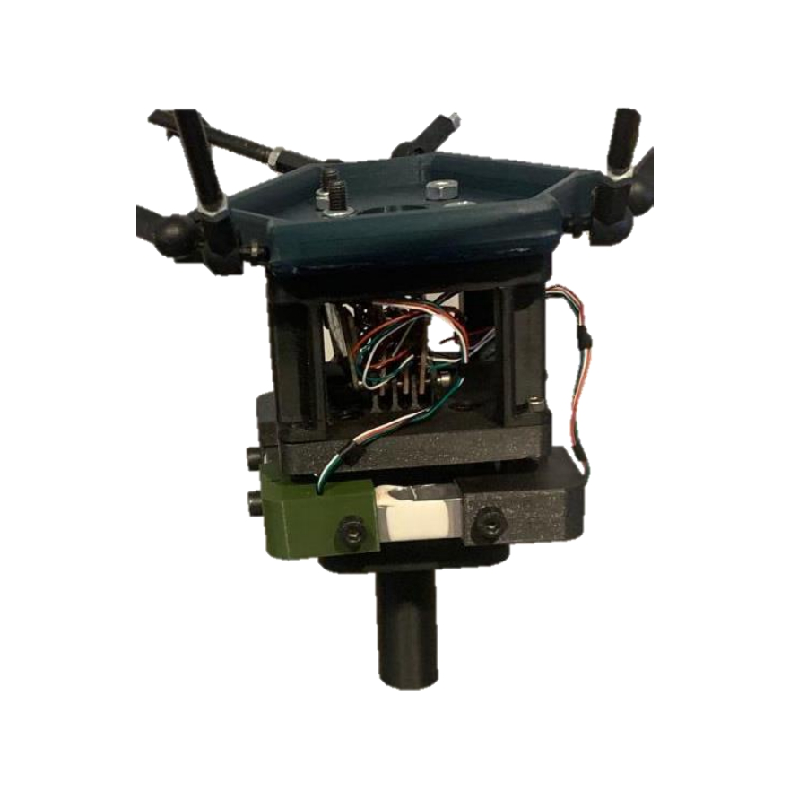

# 3-axis_force_sensor
Repo for the 3-axis force sensor

## Overview

This package contains a 3-axis force sensor for the EE of a 3-DoF manipulator

**Keywords:** ESP32, Force, Onshape

### License

**Author: Victor Rosillo<br />
University of Malaga
Maintainer: Victor Rosillo Suero, vrosillo1110@gmail.com**

<!-- This is research code, expect that it changes often and any fitness for a particular purpose is disclaimed. -->

<!-- [](http://rsl-ci.ethz.ch/job/ros_best_practices/) -->

<!--  -->


### Publications

Bachelor's Thesis: Adaptive control of a lightweight three-degree-of-freedom parallel
manipulator

### Force sensor 

3 degrees of freedom force sensor designed and manufactured by the author of this repository.



## Prerequisites

Before you begin, ensure you have the following installed:

- **Arduino IDE** (version 1.8.13 or latest)
- **ESP32 Board Support** installed in Arduino IDE


## Installation

### Installation from Packages
ROS version Melodic
    
Use `rosdep`:

	sudo rosdep install --from-paths src

To make arduino libraries work, also install the relative dependencies:
```bash
sudo apt install ros-$ROS_DISTRO-rosserial-arduino ros-$ROS_DISTRO-rosserial
```
### Building from Source

#### Building

To build from source, clone the latest version from this repository into your catkin workspace and compile the package using

	cd catkin_workspace/src
	git clone https://github.com/Robotics-Mechatronics-UMA/force_sensor_3D.git
	cd ../
	rosdep install --from-paths . --ignore-src
	catkin_make


### Install ESP32 Board Support

1. Open the Arduino IDE.
2. Navigate to `File > Preferences`.
3. In the **Additional Board Manager URLs** field, add the following URL: https://raw.githubusercontent.com/espressif/arduino-esp32/gh-pages/package_esp32_index.json
4. Click **OK**.
5. Now, go to `Tools > Board > Boards Manager`.
6. In the Boards Manager window, search for **ESP32** and click **Install** on the "ESP32 by Espressif Systems" package.


## Code Structure

The main file for this project is `Force_sensor_node.ino`.


## Usage

To upload the `Force_sensor_node.ino` file to your ESP32 board, follow these quick steps:

1. **Open the Arduino IDE**.
2. **Open the `Force_sensor_node.ino` file** from `File > Open` and select the project.
3. **Select the Board**: Go to `Tools > Board` and choose **ESP32 Dev Module**.
4. **Select the Port**: Go to `Tools > Port` and choose the port for your ESP32.
5. **Set the Baud Rate**: Make sure the baud rate is set to **115200** in `Tools > Port > Serial Monitor`.
5. **Upload the Code**: Click the arrow button (**Upload**) to send the code to the board.

Once uploaded, the code will run on the ESP32.

## Nodes
* **`force_sensor_node`**

	

## Topics

### Published Topics

* **`/Force`** ([geometry_msgs/Vector3])

	Where the reading of the force sensor will be published. Before reading the serial port information

### Subscribed Topics

* **`/Tare`** ([geometry_msgs/Vector3])

	Where bias 


##


## Bugs & Feature Requests

### Common Issues:

1. **Port Not Detected:**
- Ensure the drivers for the ESP32 are correctly installed.
- Try using a different USB cable or port on your computer.

2. **Upload Fails:**
- Hold the **BOOT** button while uploading the code.
- Ensure the correct board and port are selected in the `Tools` menu.

3. **No Output in Serial Monitor:**
- Double-check the baud rate setting in the Serial Monitor window.
- Ensure that the correct COM port is selected.
